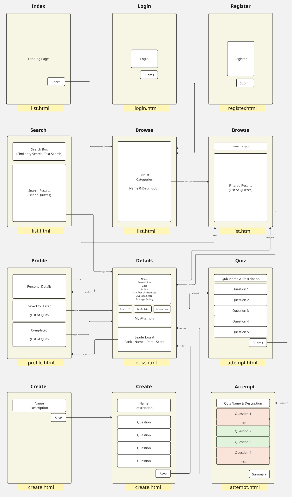

# Quizly - The Interactive Quiz Platform
Welcome to Quizly, my interactive web application that allows users to create, attempt, and share quizzes. I've built this platform with a wide range of features including quiz creation and participation, semantic search, ratings, personalized profiles, and leaderboards. I developed it using Django on the backend and HTML/CSS/JavaScript on the frontend to provide a responsive and intuitive user interface that works seamlessly across devices.

## About Me
Just to give some context before you start looking at my code, I am a professional software engineer with 30 years of experience in C / C++, but new to Python and brand new to web development. So I have a solid software engineering backround, but I have never worked with HTML, CSS, Javascript, or Django before starting this course. I hope that helps you when looking at my code, to understand why I may have done some things in a more advanced way that you would expect a new student to do.

## Distinctiveness and Complexity
I believe my Quizly project stands apart from other projects in the CS50 Web course in several ways:

### Backend Architecture
I designed the database schema with 8 interconnected Django models (User, Category, Quiz, Question, QuizAttempt, Answer, QuizRating, and SavedForLater). This data structure enabled me to create numerous relationships between entities, allowing for more features than were present in the other course projects.

### Semantic Search
One of the features I'm pleased with is the semantic search (or similarity search) functionality, which I implemented using FAISS and sentence transformers. Instead of simple keyword matching, my system allows users to find quizzes based on semantic meaning:

- Created vector embeddings for quizz names and descriptions using sentence transformers
- Indexed these embeddings in a FAISS (vector) database for efficient similarity searching
- Implemented background loading and thread synchronization for loading of the model and index, ensuring users are never blocked waiting for a lengthy loading process on the backend
- Ensured the semantic search index is updated and saved to disk after each new quiz is created, maintaining consistency between the SQL database and the FAISS index
- Ranked search results by relevance based on cosine similarity, as it produces search results that are *conceptually* similar not just *textually* similar.

I believe this implementation goes far beyond simple database queries used in previous projects and represents **a much more modern approach to search functionality in web applications**.

### Frontend Architecture
I put significantly more emphasis on JavaScript and CSS in this project compared to the previous projects:

- Spent considerable effort on the CSS to make the application look and feel modern, and I am very pleased with the look and feel of the final product
- Implemented custom UI components like a star rating dialog and custom radio buttons, all controlled through JavaScript
- Created a comprehensive list of CSS variables for consistent theming across all pages
- Incorporated external assets through stylesheets, such as Google fonts and Bootstrap icons

As you can see from the page navigation diagram below, I designed a lot of interconnectivity between pages to make the navigation user experience very intuitive



### Responsive UI/UX Design
I built a completly responsive user interface, with careful consideration for different screen sizes and aspect ratios:

- Created a collapsible sidebar that transforms based on screen width and shows touch friendly icons on smaller screens
- Developed fluid grid layouts for quiz and category listings that automatically adjust to available space
- Implemented column hiding of less important columns in tables as the screen width is reduced
- Ensured all interactive elements are touch-friendly

### Asynchronous Data Processing
I used several asynchronous processes to improve user experience:

- Built AJAX-based rating and bookmarking functionaly that doesn't require page reloads
- Implemented background loading of the sentence transformers model and FAISS search index to prevent blocking any user requests
- Created synchronization mechanisms to handle concurrent access to these shared resources

### Data Generation and Seeding
To provide a realistic user experience, I wanted to fill the database with a production quantity of test-data content so the application can be fully experienced.
- Using free online quiz questions and answers, I did some data wrangling to turn these into a suite of `json` files that could be used to seed the database.
- Hand crafted a number of custom migration scripts to fill the database with diverse categories, quizzes, users, quiz attempts, ratings, and bookmarks, for all users.

## Core Functionality
In my application, I've implemented these key features:
- **Quiz Creation**: Users can create quizzes by first selecting a category and entering a quiz name and description, and then adding multiple questions and answers to their quiz
- **Quiz Attempting**: Users can attempt quizzes, receive scores, and see hints for their incorrect answers to assist them if they choose to retry the same quiz
- **Leaderboards**: Each quiz has a leaderboard where users can compare their best scores against others
- **Browse**: Added a browse option to filter by category and then explore quizzes within any one of the 50 quiz categories
- **Search**: Implemented both semantic and keyword search options for finding a quiz to your liking
- **User Profiles**: Each user has a public browsable profile page showing their quiz history and bookmarked quizzes
- **Ratings**: Created a system where users can rate each quiz on a 5-star scale, influencing an average rating across all users
- **Save For Later**: Added functionality for users to bookmark quizzes to attempt later directly from their personal profile page

## File Structure and Description

### Django Models (models.py)
- Defined 8 models (User, Category, Quiz, Question, QuizRating, QuizAttempt, Answer, SavedForLater)
- Included numerous methods on the models for calculating quiz statistics, leaderboards, average ratings across all users, and user progress
- Fully customized the admin interface for easy data management

Below is the database schema I designed for the application.


### Views
To reduce complexity, I split the views into multiple Python files:
- **account.py**: Handling of user authentication (login, logout, registration)
- **browse.py**: Managing category and quiz browsing
- **search.py**: Created both keyword and semantic search functionality
- **create.py**: Control quiz and question creation
- **profile.py**: User profile display with personal details, quiz history, and bookmarked quizzes
- **quiz.py**: Implemented quiz viewing, quiz attempting, leaderboards, ratings, and bookmarking

### Services
- **faiss_search_service.py**: Implemented similarity search and adding quizzes to the vector database using FAISS and sentence transformers
- Includes background loading and thread synchronization for performance optimization

### Management
I created a number of management utilities that are called from the migration, and can also be called from the command line via manage.py
- **build_faiss_index.py**: Queries the database and creates vector embeddings for all existing quizzes (called as a part of the migration)
- **download_search_model.py**: Checks if the sentence transformers model (all-MiniLM-L6-v2) is downloaded, and if not it will be downloaded

### Migrations and Data Generation
- I consolidated creation of all of the models to a single schema migration
- Authored 6 hand-crafted migrations for adding a high volume of test data, either from json test-data files or procedurally
- Finally checks if the sentence transformers model is downloaded, and if not it will be downloaded, and then the FAISS index will be built

### Templates
I organized my templates as follows:
- **layout.html**: Base template with a responsive sidebar
- **index.html**: Landing page with feature highlights for the application
- **list.html**: Displays quizzes or categories in a grid layout, with search capability
- **quiz.html**: Shows quiz details, attempts, and ratings
- **attempt.html**: Interface for taking quizzes and viewing results
- **create.html**: Form for creating quizzes and questions
- **profile.html**: User profile with quiz history
- **register.html** and **login.html**: Authentication forms

### CSS Static Files
- **global-variables.css**: Defined theme colors, spacing, and fonts used by all other pages and stylesheets
- **styles.css**: Created base styles for the application, used by all pages
- **bootstrap-overrides.css**: Overrode bootstrap defaults to set specific theme colors and styles
- Developed custom stylesheets for each template (**account.css, attempt.css, create.css, index.css, list.css, profile.css, and quiz.css**)

### JavaScript Static Files
- **quiz.js**: Handles quiz interactions, ratings, and saving
- **attempt.js**: Manages quiz attempts and answer selection
- **create.js**: Controls the quiz creation interface
- **list.js**: Manages the search interface
- **index.js**: Handles the landing page interaction

## What I Could Improve

There are a number of things I could definitely improve, and expand on to make the application better, however I implemented what I believed to be the MVP features and then spent time on polish, rather than adding more features and not having time to polish them.

### Improvements I would like to Make
- Even after countless hours working on the CSS, I feel that there is still a lot of duplication. I think if I thought about components more from the start, I could have had a lot more common styles and less styles specific to each page.
- I feel that I could have done more error checking and error handling in the code, especially in the views.

### Features I would like to Add
- Hide the personal details of other users when you visit their profile page
- Differentiate more between the categories and the quizzes, they look very alike other than the shape of their container on the page
- Show more information on each quiz while browsing, such as if the user has it bookmarked, and what its star rating is
- Add the ability to use 3 free hints per day while attempting a quiz, rather than just using the hints when you are looking and incorrect quiz results

## How to Run the Application

### Prerequisites
- Python 3.12.9 or higher
- Pip package manager
- Virtual environment or Conda

### Installation
1. Create and activate a virtual environment:
   ```bash
   python -m venv venv
   source venv/bin/activate
   ```

2. Install dependencies:
   ```bash
   pip install -r requirements.txt
   ```

3. Download the semantic search model (~90MB):
   ```bash
   python manage.py download_search_model
   ```

4. Run the development server:
   ```bash
   python manage.py runserver
   ```

5. Access the application at `http://127.0.0.1:8000`

### Default Users
The application comes with several pre-created users for testing. New users can be created through the Register User function of the app. 
- To access the admin interface `http://127.0.0.1:8000/admin`, login with: *Username:* `admin`, *Password:* `admin`
- To access the test user that was used in the video, login with: *Username:* `mike74`, *Password:* `mike`
