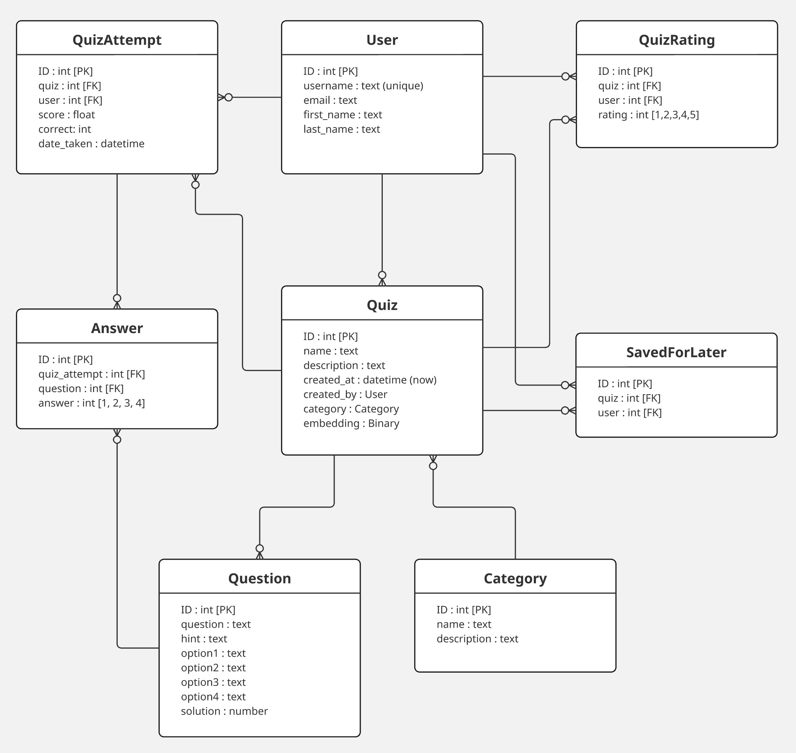

# Quizly - Interactive Quiz Platform
Welcome to Quizly, my interactive web application that allows users to create, attempt, and share quizzes. I've built this platform with a wide range of features including quiz creation and participation, semantic search, ratings, personalized profiles, and leaderboards. I developed Quizly using Django on the backend and HTML/CSS/JavaScript on the frontend to provide a responsive and intuitive user interface that works seamlessly across devices.

## About Me
Just to give some context before you start looking at my code, I am a professional software engineer with ~30 years of experience in C / C++, but new to Python and brand new to web development. So I have a solid software engineering backround, but I have never worked with HTML, CSS, Javascript, or Django before starting this course.  I hope that helps you when looking at my code, to understand why I may have done some things in a more advanced way that you would expect a new student to do.

## Distinctiveness and Complexity
I believe my Quizly project stands apart from other projects in the CS50 Web course in several significant ways:

### Backend Architecture
I designed a multi-model database schema with 8 interconnected Django models (User, Category, Quiz, Question, QuizAttempt, Answer, QuizRating, and SavedForLater). This data structure enabled me to create numerous relationships between entities, allowing for more features than were present in the other course projects.

### Semantic Search
One of the features I'm proud of is the semantic search functionality, which I implemented using FAISS and sentence transformers. Instead of simple keyword matching, my system allows users to find quizzes based on semantic meaning:

- I created vector embeddings for quizzes using sentence transformers
- I indexed these embeddings in a FAISS database for efficient similarity searching
- I implemented background loading and thread synchronization to load the model and index file, ensuring users are never blocked waiting for a lengthy loadinf process on the backend
- I ensured the semantic search index is updated and saved to disk after a new quiz is created, maintaining consistency between the SQL database and the FAISS index
- I ranked search results by relevance based on cosine similarity

I believe this implementation goes far beyond simple database queries used in previous projects and represents a more modern approach to search functionality in web applications.

### Advanced Frontend Architecture
I put significantly more emphasis on JavaScript and CSS in this project compared to others:

- I spent considerable effort on the CSS to make the application look and feel modern
- I implemented custom UI components like a star rating system and custom radio buttons, all controlled through JavaScript
- I created a comprehensive CSS variable system for consistent theming across all pages
- I incorporated external assets through stylesheets, such as Google fonts and Bootstrap icons

As you can see from the page navigation diagram below, I designed a lot of interconnectivity between pages to make the navigation user experience very intuitive.


### Responsive UI/UX Design
I built a complete responsive design system, with careful consideration for different screen sizes:

- I took a mobile-first approach with support for different device sizes on every page
- I created a collapsible sidebar that transforms based on screen width and shows touch friendly icons on small screen sizes
- I developed fluid grid layouts for quiz and category listings that automatically adjust to available space
- I implemented column hiding of less important columns in tables as the screen width is reduced
- I ensured all interactive elements are touch-friendly

### Asynchronous Data Processing
I used several asynchronous processes to improve user experience:

- I built AJAX-based rating and saving functionalities that don't require page reloads
- I implemented background loading of the sentence transformers model and FAISS search index to prevent blocking the main application
- I created synchronization mechanisms to handle concurrent access to shared resources

### Data Generation and Seeding
To provide a realistic user experience, I wrote a data generation system that created a production quantity of test-data content so the application can be fully experienced.

- I developed quiz and quiz-question generation capabilities for creating realistic test data
- I hand crafted multi-step migrations to seed the database with diverse categories, quizzes, users, and quiz attempt history, along with a list of users and associated user data

## Core Functionality
In my application, I've implemented these key features:
- **Quiz Creation**: Users can create quizzes by first selecting a category and entering a quiz name and theme, and then adding multiple questions and answers to their quiz
- **Quiz Taking**: Users can attempt quizzes, receive scores, and see hints for their incorrect answers to assist them if they choose to retry the same quiz
- **Leaderboards**: Each quiz has a leaderboard where users can compare their best scores against others
- **Browse**: I added a browse option to filter by category and then explore quizzes within that category
- **Search**: I implemented both semantic and keyword search options for finding quizzes
- **User Profiles**: Each user has a public browsable profile page showing their quiz history and bookmarked quizzes
- **Ratings**: I created a system where users can rate each quiz on a 5-star scale and see an average rating across all users
- **Save For Later**: I added functionality for users to bookmark quizzes to attempt later

## File Structure and Description

### Django Models (models.py)
- I defined 8 interconnected models (User, Category, Quiz, Question, QuizRating, QuizAttempt, Answer, SavedForLater)
- I included numerous methods for calculating quiz statistics, leaderboards, average ratings across all users, and user progress
- I fully customized the admin interface for easy data management

Below is the database schema I designed for the application.



### Views
To reduce complexity, I split the views into multiple files:
- **account.py**: Handling of user authentication (login, logout, registration)
- **browse.py**: Managing category browsing and quiz listing
- **create.py**: Control quiz and question creation
- **profile.py**: A user profile display with quiz history and bookmarked quizzes
- **quiz.py**: Implemented quiz viewing, attempts, leaderboards, ratings, and bookmarking
- **search.py**: I created both keyword and semantic search functionality

### Services
- **faiss_search_service.py**: I implemented vector embeddings and similarity search using FAISS and sentence transformers
- I included background loading and thread synchronization for performance optimization

### Migrations and Data Generation
I consolidated the models to a single schema migration, followed by 6 hand-crafted migrations for procedurally adding a high volume of test data.
- **generate_quizzes.py**: I wrote this quiz generation script for creating test data JSON files (a one-off process), which are later used during migrations to seed the database
- **build_faiss_index.py**: I created this script to generate vector embeddings and the FAISS index for semantic search as the final migration step, ensuring all setup is complete when migrations finish

### Templates
I organized my templates as follows:
- **layout.html**: Base template with a responsive sidebar
- **index.html**: Landing page with feature highlights for the application
- **list.html**: Displays quizzes or categories in a grid layout, with search capability
- **quiz.html**: Shows quiz details, attempts, and ratings
- **attempt.html**: Interface for taking quizzes and viewing results
- **create.html**: Form for creating quizzes and questions
- **profile.html**: User profile with quiz history
- **register.html** and **login.html**: Authentication forms

### Static Files

- CSS:
  - **global-variables.css**: I defined theme colors, spacing, and fonts used by all other pages and stylesheets
  - **styles.css**: I created base styles for the application, used by all pages
  - **bootstrap-overrides.css**: I overrode bootstrap defaults to set specific theme colors and styles
  - I developed custom stylesheets for each page (**account.css, attempt.css, create.css, index.css, list.css, profile.css, and quiz.css**)

- JavaScript:
  - **quiz.js**: Handles quiz interactions, ratings, and saving
  - **attempt.js**: Manages quiz attempts and answer selection
  - **create.js**: Controls the quiz creation interface
  - **list.js**: Manages the search interface
  - **index.js**: Handles the landing page interaction

## How to Run the Application

### Prerequisites
- Python 3.12.9 or higher
- Pip package manager
- Virtual environment or Conda

### Installation
1. Create and activate a virtual environment:
   ```bash
   python -m venv venv
   source venv/bin/activate
   ```

2. Install dependencies:
   ```bash
   pip install -r requirements.txt
   ```

3. Download the semantic search model (~40MB):
   ```bash
   python manage.py download_search_model
   ```

4. Run the development server:
   ```bash
   python manage.py runserver
   ```

5. Access the application at `http://127.0.0.1:8000`

### Default Users
The application comes with several pre-created users for testing. New users can be created through the Register User function of the app. To access the admin interface, login with the admin user:
- Username: `admin`, Password: `admin`


